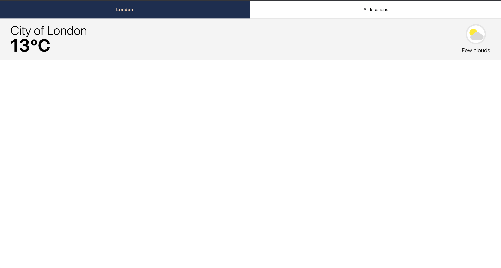
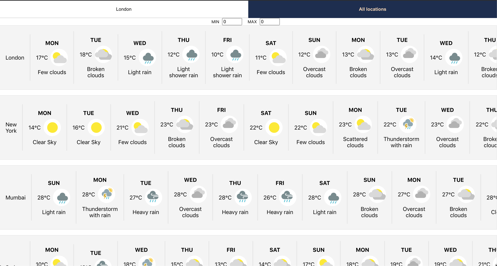

## Setup
- Git clone the repo
- From the root directory use `npm install` then `npm start`
- Application should launch in a new browser window (if not just go to http://localhost:3000)

## Testing
- From the root directory use `npm run test`

## Problems to solve
- The app has some bugs which stop the UI rendering properly once the user interacts with the page

## You need to
- Identify the bugs and fix them
- Add any improvements you think are necessary to improve the code quality

### The app should look like this: 

